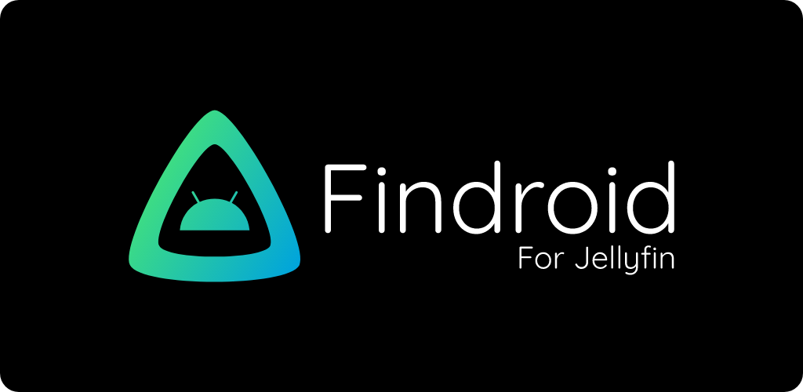
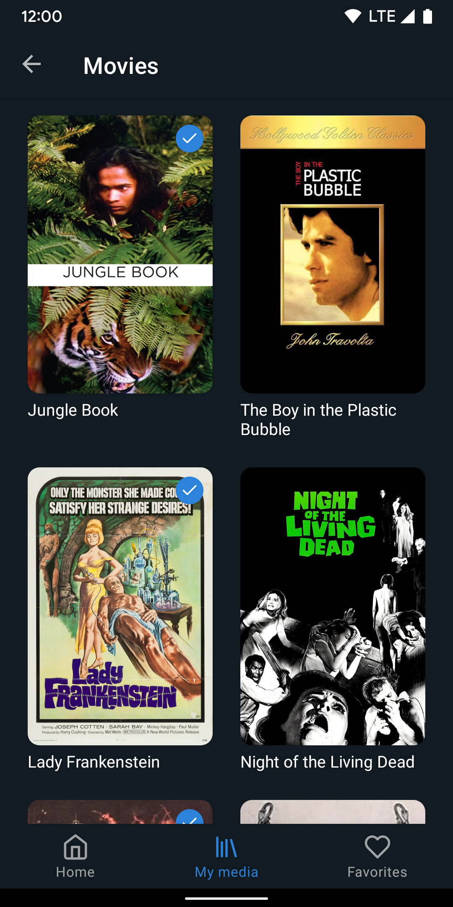
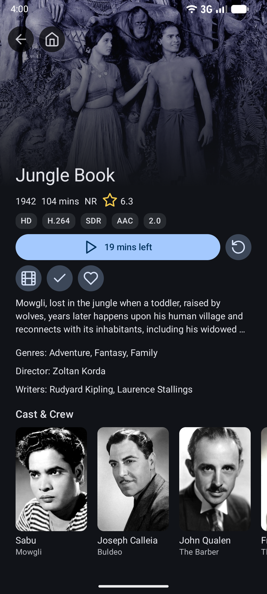
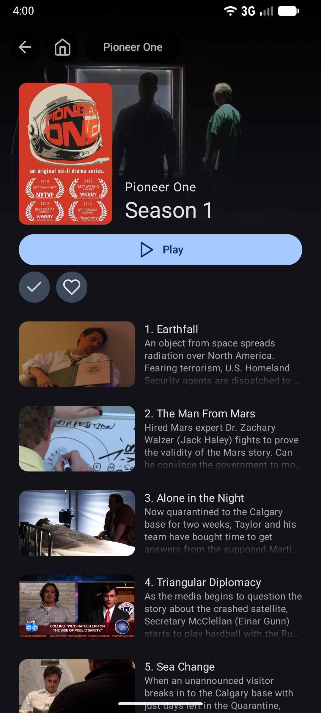
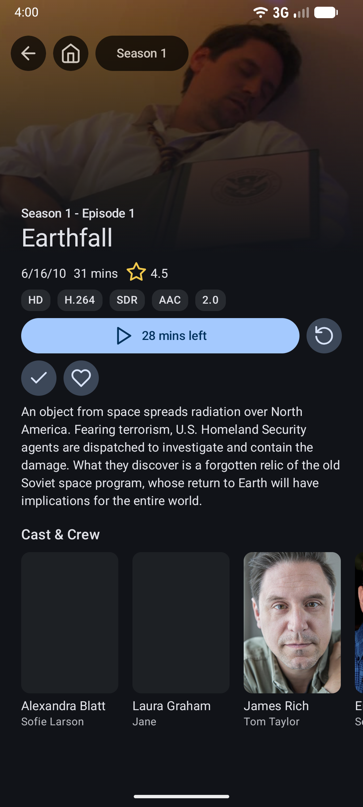

# Findroid

Findroid is third-party Android application for Jellyfin that provides a native user interface to browse and play movies and series.

I am developing this application in my spare time.

**This project is in its early stages so expect bugs.**

## Screenshots
| Home                                | Library                             | Movie                           | Season                            | Episode                             |
|-------------------------------------|-------------------------------------|---------------------------------|-----------------------------------|-------------------------------------|
|  |  |  |  |  |

## Features
- Completely native interface
- Supported media items: movies, series, seasons, episodes 
  - Direct play only, (no transcoding)
- Offline playback / downloads
- ExoPlayer
  - Video codecs: H.263, H.264, H.265, VP8, VP9, AV1 
    - Support depends on Android device
  - Audio codecs: Vorbis, Opus, FLAC, ALAC, PCM, MP3, AMR-NB, AMR-WB, AAC, AC-3, E-AC-3, DTS, DTS-HD, TrueHD 
    - Support provided by ExoPlayer FFmpeg extension
  - Subtitle codecs: SRT, VTT, SSA/ASS, PGSSUB
    - SSA/ASS has limited styling support see [this issue](https://github.com/google/ExoPlayer/issues/8435)
- mpv
  - Container formats: mkv, mov, mp4, avi
  - Video codecs: H.264, H.265, VP8, VP9, AV1
  - Audio codecs: Opus, FLAC, MP3, AAC, AC-3, E-AC-3, TrueHD, DTS, DTS-HD
  - Subtitle codecs: SRT, VTT, SSA/ASS, DVDSUB
  - Optionally force software decoding when hardware decoding has issues.
- Picture-in-picture mode

## Planned features
- Android TV
- Websocket connection (Syncplay)
- Chromecast support

## Translating
[JDTech Weblate](https://weblate.jdtech.dev) is a selfhosted instance of Weblate where you can translate this project and future projects of mine.

## Questions?
\
We have a Discord server to discuss future development or ask general questions.

## License
This project is licensed under [GPLv3](LICENSE).

The logo is a combination of the Jellyfin logo and the Android robot.

The Android robot is reproduced or modified from work created and shared by Google and used according to terms described in the Creative Commons 3.0 Attribution License.

Android is a trademark of Google LLC.

Google Play and the Google Play logo are trademarks of Google LLC.
