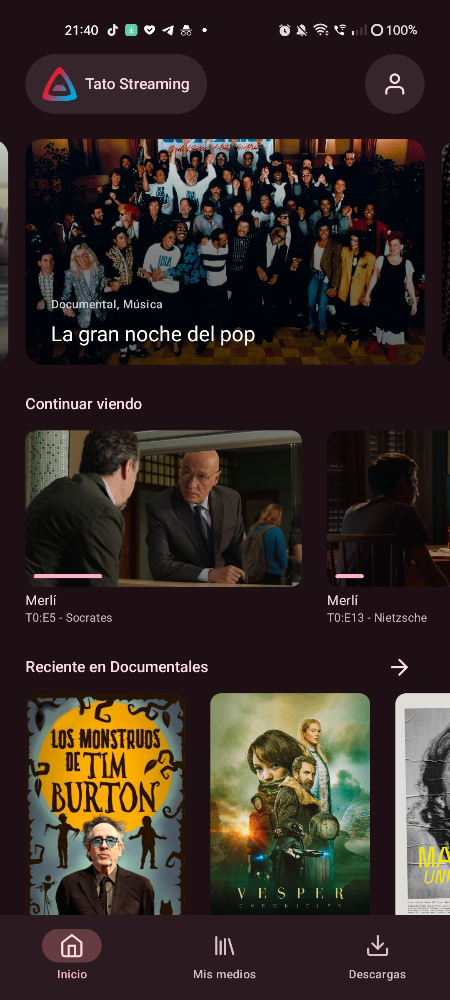
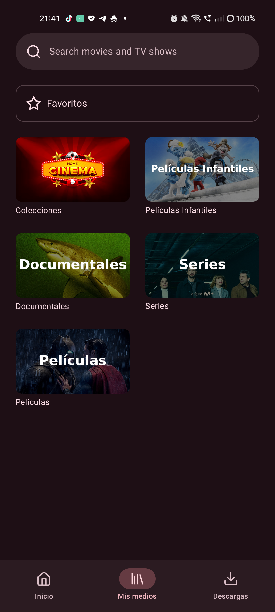
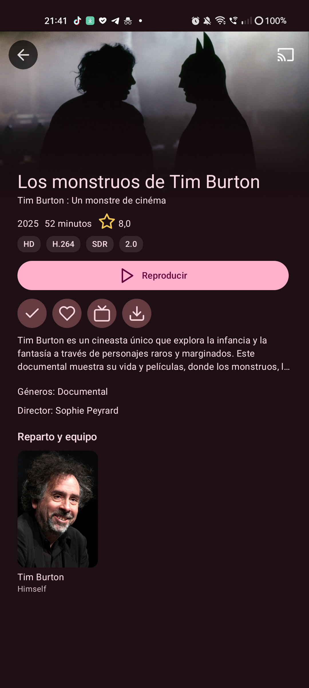
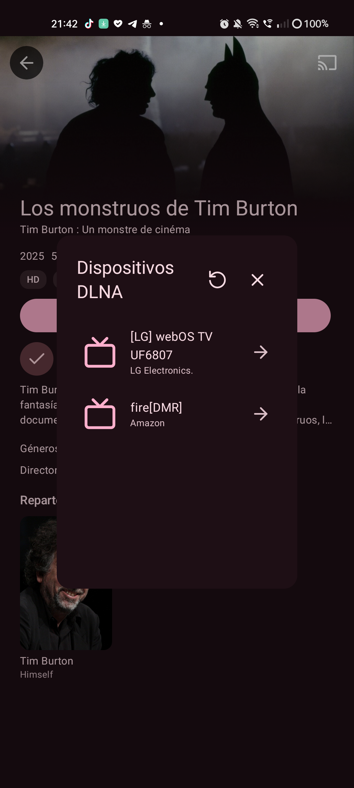
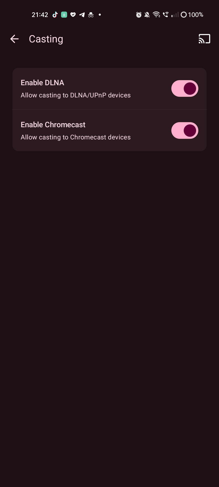

# JellyCast

**A feature-rich Jellyfin client for Android with DLNA casting support**

[Features](#features) • [Screenshots](#screenshots) • [Technology](#technology-stack) • [Credits](#credits)

---

> [!NOTE]
> JellyCast is based on [JellyCast 0.15.3](https://github.com/jarnedemeulemeester/jellycast) with significant additional features and improvements.

## 🎯 What's New in JellyCast

JellyCast extends the original JellyCast with powerful new capabilities:

### 🎭 **DLNA Casting**
Stream your media to any DLNA-enabled device on your network:
- 📡 Automatic device discovery
- 🎮 Full playback control (play, pause, stop, seek, volume)
- 📺 Support for smart TVs, speakers, and media renderers
- 🎬 Works with both movies and TV series

### 📥 **Enhanced Downloads**
Beautiful download management with real-time feedback:
- ⭕ Circular progress indicators with percentage display
- 🌫️ Elegant blur effects on downloading items
- 📊 Live progress updates
- 📺 Automatic series grouping in Downloads section

### 🎨 **UI Improvements**
- ✨ Refined status bar handling
- 🎯 Better visual hierarchy
- 🔄 Improved state synchronization
- ⚙️ Settings toggles for DLNA and Chromecast

## Screenshots

### Main Interface
| Home | Library | Movie Details |
|------|---------|---------------|
|  |  |  |

### New Features
| DLNA Casting | Downloads Progress | Settings |
|--------------|-------------------|----------|
|  |  |  |

## ✨ Features

### 🆕 JellyCast Exclusive Features

#### DLNA Casting
- 🔍 **Device Discovery**: Automatic detection of DLNA devices on your network
- 🎮 **Full Control**: Play, pause, stop, seek, and volume control
- 📱 **Mini Player**: Persistent playback controls
- 🎬 **Universal Support**: Works with movies and TV series

#### Download Experience
- ⭕ **Visual Progress**: Circular indicators with real-time percentage
- 🌫️ **Blur Effects**: Beautiful visual feedback during downloads (Android 12+)
- 📺 **Smart Grouping**: Episodes automatically organized by series
- 🗑️ **Instant Updates**: Download list refreshes immediately after deletions

#### Settings & Control
- ⚙️ **DLNA Toggle**: Enable/disable DLNA functionality
- 📡 **Chromecast Toggle**: Control Chromecast availability
- 🎯 **User-Friendly**: Easy access to all casting options

### 🎥 Core Features (from JellyCast)

#### Media Support
- 🎬 **Content Types**: Movies, TV series, seasons, episodes
- 📥 **Offline Playback**: Download and watch without internet
- 🎯 **Direct Play**: No transcoding required for compatible formats

#### ExoPlayer Integration
- 🎞️ **Video Codecs**: H.263, H.264, H.265, VP8, VP9, AV1
  - Support depends on device capabilities
- 🔊 **Audio Codecs**: Vorbis, Opus, FLAC, ALAC, PCM, MP3, AAC, AC-3, E-AC-3, DTS, DTS-HD, TrueHD
  - Enhanced by ExoPlayer FFmpeg extension
- 📝 **Subtitles**: SRT, VTT, SSA/ASS, PGSSUB
  - SSA/ASS with [limited styling](https://github.com/google/ExoPlayer/issues/8435)

#### MPV Alternative
- 📦 **Containers**: MKV, MOV, MP4, AVI
- 🎞️ **Video**: H.264, H.265, H.266, VP8, VP9, AV1
- 🔊 **Audio**: Opus, FLAC, MP3, AAC, AC-3, E-AC-3, TrueHD, DTS, DTS-HD
- 📝 **Subtitles**: SRT, VTT, SSA/ASS, DVDSUB
- 💻 **Software Decoding**: Optional fallback for hardware issues

#### Advanced Features
- 📺 **Picture-in-Picture**: Watch while using other apps
- 📑 **Media Chapters**: Timeline markers and gesture navigation
- 🎯 **Trickplay**: Thumbnail previews (Jellyfin 10.9+)
- ⏭️ **Media Segments**: Auto-skip intros/credits (Jellyfin 10.10+)

## 🛠️ Technology Stack

### DLNA Implementation
- **Server**: Jetty 9.4.54.v20240208
- **UPnP Stack**: jUPnP 3.0.2
- **Discovery**: AndroidUpnpServiceConfiguration

### UI Framework
- **Compose**: Jetpack Compose with Material 3
- **Design**: Material Design 3 components
- **Effects**: RenderEffect API for blur (Android 12+)

### Architecture
- **Pattern**: MVVM (Model-View-ViewModel)
- **Async**: Kotlin Coroutines & Flow
- **DI**: Hilt for dependency injection
- **Persistence**: Room database for downloads

## 🚀 Planned Features
- 📺 **Android TV**: Full TV interface support
- 🔗 **Syncplay**: WebSocket-based synchronized playback
- 📡 **Enhanced Chromecast**: Improved casting experience

## 🙏 Credits

This project is based on [**JellyCast**](https://github.com/jarnedemeulemeester/jellycast) version **0.15.3** by [Jarne De Meulemeester](https://github.com/jarnedemeulemeester).

Special thanks to:
- The original JellyCast project and all its contributors
- The Jellyfin community
- All open-source libraries used in this project

## 📄 License
This project is licensed under [GPLv3](LICENSE).

The logo is a combination of the Jellyfin logo and the Android robot.

The Android robot is reproduced or modified from work created and shared by Google and used according to terms described in the Creative Commons 3.0 Attribution License.

Android is a trademark of Google LLC.

Google Play and the Google Play logo are trademarks of Google LLC.
