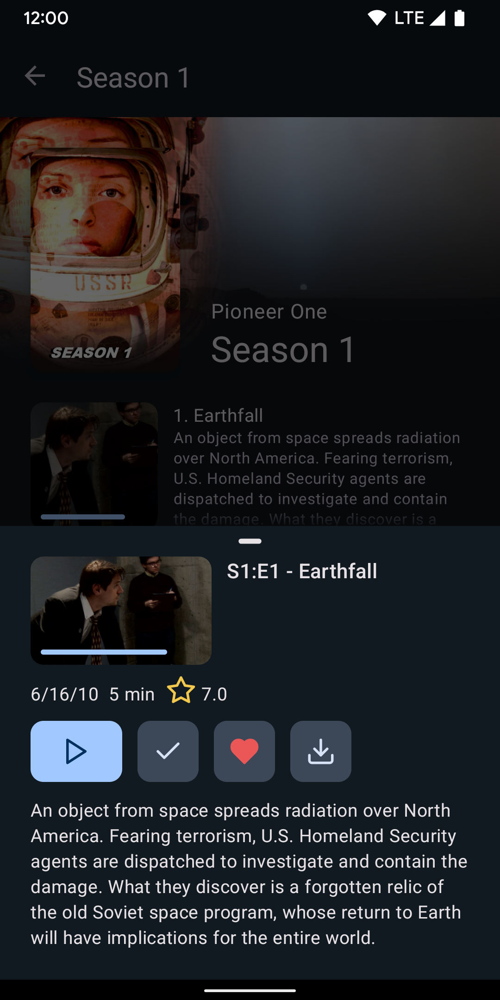

# Findroid

Findroid is third-party Android application for Jellyfin that provides a native user interface to browse and play movies and series.

I am developing this application in my spare time.

**This project is in its early stages so expect bugs.**

## Screenshots
Home | Library | Movie | Season | Episode
-----|---------|-------|--------|--------
 |  |  |  | 

## Features
- Completely native interface
- Supported media items: movies, series, seasons, episodes 
  - Direct play only, (no transcoding)
- Video codes: H.263, H.264, H.265, VP8, VP9, AV1 
  - Support depends on Android device
- Audio codes: Vorbis, Opus, FLAC, ALAC, PCM µ-law, PCM A-law, MP1, MP2, MP3, AMR-NB, AMR-WB, AAC, AC-3, E-AC-3, DTS, DTS-HD, TrueHD 
  - Support provided by ExoPlayer FFmpeg extension
- Subtitle codecs: SRT, VTT, SSA/ASS, PGSSUB
  - SSA/ASS has limited styling support see [this issue](https://github.com/google/ExoPlayer/issues/8435)

## Planned features
- Websocket connection (Syncplay)
- Caching
- Offline playback / downloads
- Picture in picture mode
- Chromecast support

This project is licensed under [GPLv3](LICENSE).

The logo is a combination of the Jellyfin logo and the Android robot.

The Android robot is reproduced or modified from work created and shared by Google and used according to terms described in the Creative Commons 3.0 Attribution License.

Android is a trademark of Google LLC.